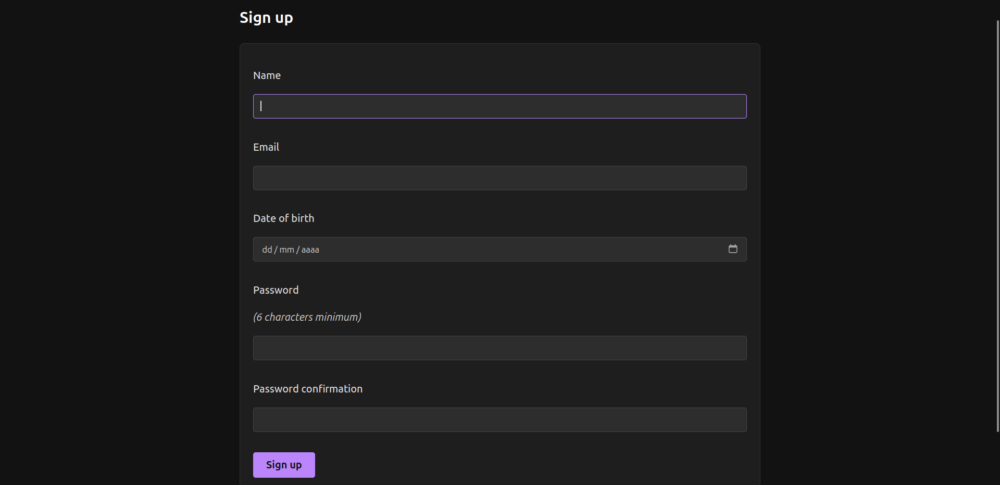
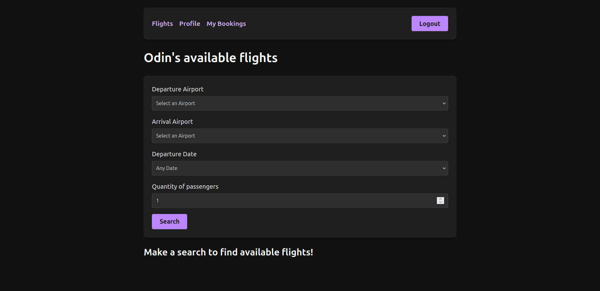
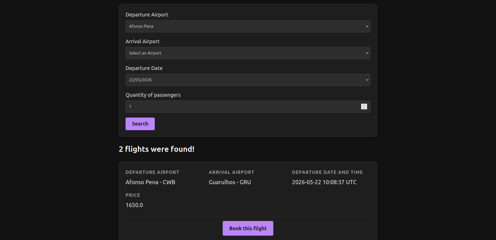
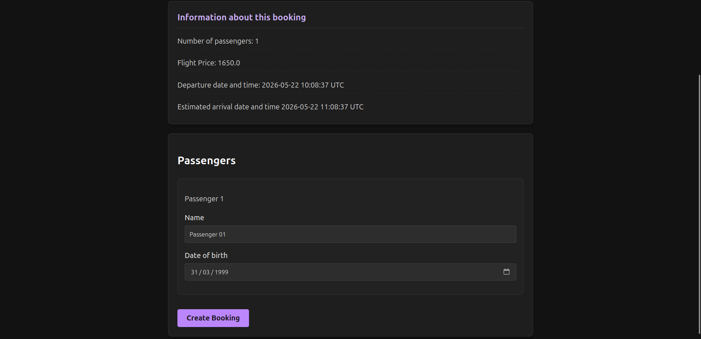
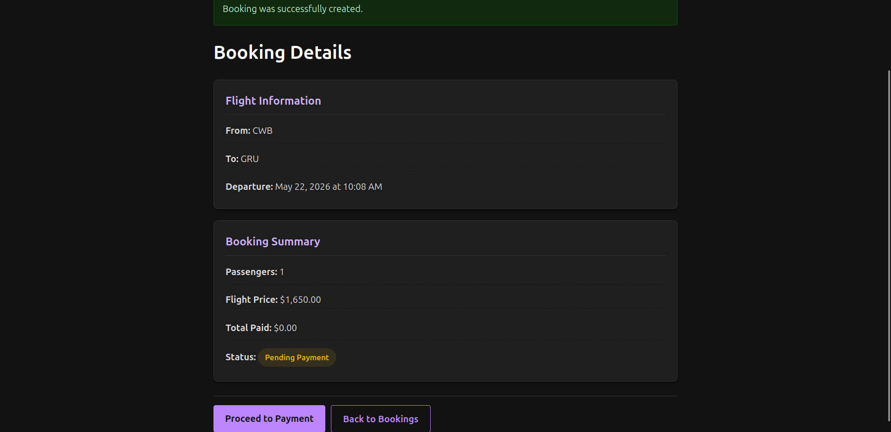
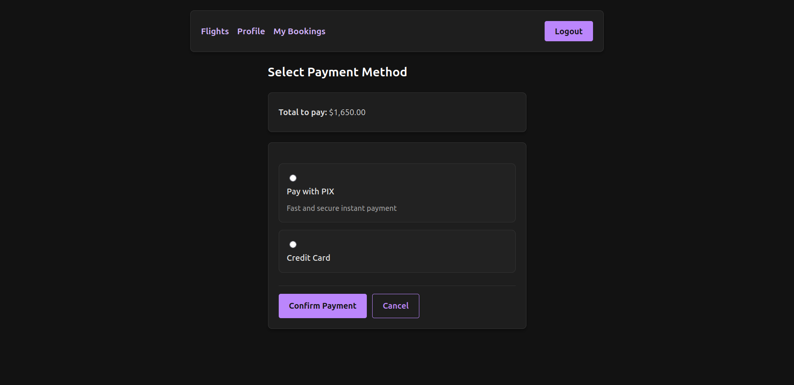
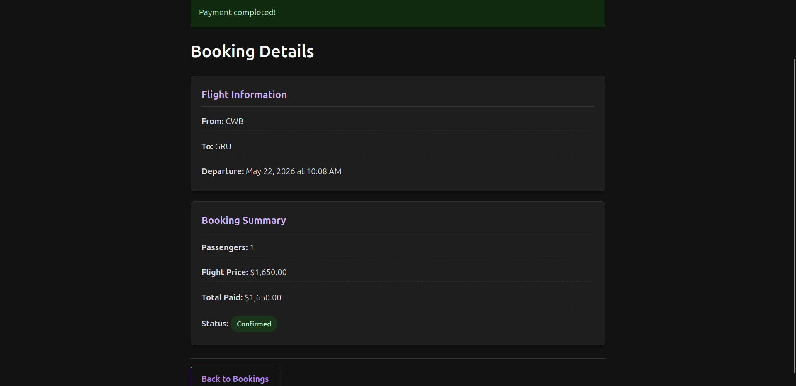
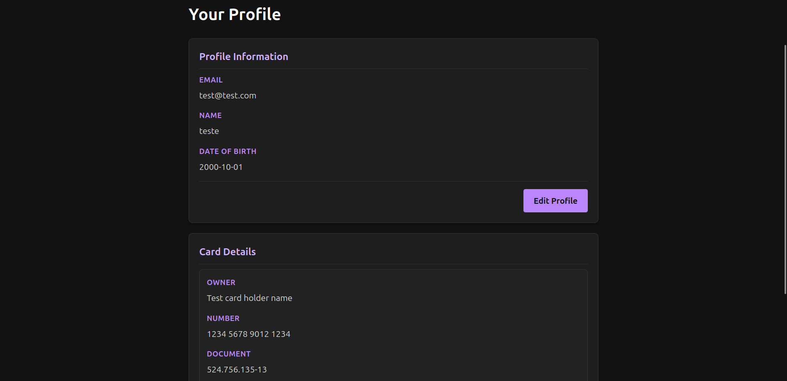
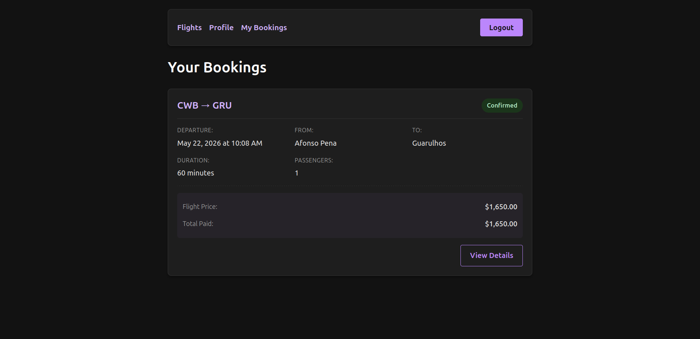

# Welcome!

## Summary

- [Introduction](#Introduction)
  - [Objectives Overview](#objectives-overview)
  - [Primary Objectives](#primary-objectives)
  - [Secondary Objectives](#secondary-objectives)
- [Project Details](#project-details)
  - [Database](#database)
    - [DBMS](#dbms)
    - [Docker Developement](#docker-development)
- [Final Results](#final-results)
  - [Final Considerations](#final-considerations)
  - [Images](#images)
  - [What I learned](#what-i-learned)

## Introduction

This project was developed with the unique goal of improving my abilities on Ruby on Rails,
 a language which I've been studying for quite a while. This is the first (of many still to come)
"complete" project built with this intention.

### Objectives Overview

Although this is going to be a great opportunity to play around with many rails features, 
there are some specific features I intend to develop and I think that there is enough room
to address them all.

#### Primary Objectives

- Advanced Forms Management;
- Active Record Callbacks, Associations, Queries, Migrations and Polymorphic Relations.
- Basic Authentication (with Devise) and Session Management.

#### Secondary Objectives

- Turbo
- Asset Pipeline

## Project Details

The purpose of this project is to build a Flight Booker, making use of the many useful
resources given out-of-the-box by Rails.
The main functionalities are basically Flight Bookings by users, with the option to add one or more
passengers to every booking. The app is going to be built with easy future expansion capabilities in mind—and this will
reflect some decisions along the way. Some of these features won't be used right away, but the idea is to
construct the project looking to a farther horizon.

These are the main Domain Rules that will dictate the development of this project:

> The implementation of anything related to payment will only be mocked.
> No owned or third-party payment gateways will be used.

- A user should be able to create one or more bookings.
- A user should be able to add more passengers to a booking by inserting their personal data.
- A user can create of modify its own cards information
- The system should be able to handle different forms of payment (like credit card or the brazilian PIX)
- The system should be capable of handling multiple payments for a single booking
  - This feature won't be implemented, only it's "skeleton" (at least for now).
- Each booking can have many passengers
- Each booking should only be related to one flight
- Each flight should hold information about its own departure and arrival datetime and cities, as well as price and capacity.
- Each flight is related to a route
- Each route can be used on many flights
- Each route should hold the information about the departure and arrival cities.

### Database

#### DBMS

The chosen DMBS is PostgreSQL. This decision comes from the fact that this tool is popular, and its usage is very
widespread.

### Docker Development

For local development, this project includes a `development` target in `Dockerfile` plus `docker-compose.yml`.

```bash
docker compose up --build
docker compose exec app bin/rails db:prepare
```

The app is available at `http://localhost:3000` and PostgreSQL at `localhost:5432`.

## Final results

### Final Considerations

This project was a great opportunity to explore a little bit further what I learned 
at Odin Project on the Rails course. My main focus was completed, but there are some
areas that I still want to explore - but I'll do it in the future. A good example is testing.
This project completely lacks any testing coverage, a problem that I'm planning to solve in
the near future.

### Images

Below, I'll display some images of the system as of now.

#### Sign Up

As mentioned, this project uses Devise for abstracting user authentication and management. Because of this, our sign up
screen is built on top of Devise's default, but with some added datails.



#### Flight Search

Here, our users can query available flights and proceed with a new booking. These fields were specified on Odin's project
description.





#### Flight Booking

A flight can be booked by an authenticated user. While booking, it's possible to add more passengers per booking (up to 4).
This constraint was specified on Odin's project description. Also, the number of passengers is defined by a URL param,
sent when the user clicks on the button to book a flight.



#### Booking Details

Every booked flight has a dedicated screen to show it's specific information. This screen can be accessed by either booking
a new flight or looking into the "My Bookings" screen. This panel displays departure and arrival cities, departure timestamp,
 number of passengers, total price and current status (pending payment or confirmed). Here, it's possible to proceed to payment
(if not already paid).



#### Payment

As said on introduction, this project was designed with expansion capabilities in mind. Because of this, it uses polymorphic
relations for easy addition of new payment methods. There are two currently available methods: credit card and brazilian
PIX. None of them uses a complex or real payment gateway. This system just "pretends" everything works (after all, real
payments are not the focus here). Because of the nature of polymorphic relations, new forms of payments can be easily added.





#### User Profile

The user profile screen simply displays information about our user and gives them the ability to change their personal
information and manage their cards. It's important to say that cards are not deleted, but rather marked as "inactive"
for auditing purposes.



#### My Bookings

This screen is simply direct access to all bookings for the current user.



### What I learned

This project was a great opportunity to really grasp some concepts I've studied at Odin's Rails course. Some of my main
focuses had me thinking and rebuilding some parts of this project a few
times. For instance, I had a little bit of trouble understanding and applying UI collections using rails helpers and 
dealing with nested attributes. Beyond that, I performed some refactors on my database and models because of a
misconception on how polymorphic relations really work. Besides these, my overall experience was very fluid.

